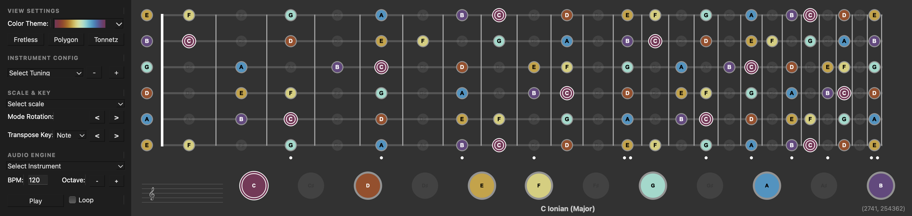

# SIREN

**S**cale **I**nteractive **R**endering **E**ngine & **N**avigator

A musical scale visualization and exploration tool built with Python and PySide6.



## Prerequisites

Before setting up the Python environment, ensure you have Python 3.10 or newer installed. On Linux, you must install the system-level PortAudio library.

### Linux (Ubuntu/Debian)

Open a terminal and run:

```bash
sudo apt-get update
sudo apt-get install python3-venv python3-pip portaudio19-dev
```

### macOS

Using [Homebrew](https://brew.sh/):

```bash
brew install python3
```

### Windows

Download and install Python from [python.org](https://www.python.org/downloads/). Ensure you check the box **"Add Python to PATH"** during the installation process.

## Installation

### 1. Set up the Virtual Environment

It is recommended to use a virtual environment to keep dependencies isolated.

**Linux / macOS:**

```bash
# Create the virtual environment named .venv
python3 -m venv .venv

# Activate the virtual environment
source .venv/bin/activate
```

**Windows (Command Prompt):**

```cmd
:: Create the virtual environment named .venv
python -m venv .venv

:: Activate the virtual environment
.venv\Scripts\activate
```

### 2. Install Python Packages

With the virtual environment activated, install the required libraries:

```bash
pip install -r requirements.txt
```

## Running the Application

To start the application, run `main.py` from the repository root:

```bash
python main.py
```

## Interactions Guide

### Global Keyboard Shortcuts
| Key | Action |
| :--- | :--- |
| **Left / Right** | Rotate Modes (Circular Shift) |
| **Shift + Left / Right** | Transpose Key (Semitones) |
| **Up / Down** | Transpose Key (Circle of Fifths +/- 7) |
| **Space** | Toggle Enharmonic Spelling (Sharps/Flats) |
| **0** | Clear Scale (Silence) |
| **1-7, Q-Y** | Toggle specific scale degrees relative to root |

### Mouse Interactions

#### Scale Selector (Top Ribbon)
*   **Left Click**: Toggle note activation.
*   **Right Click (on Note)**: Set as Root Note.
*   **Right Click (on Root)**: Toggle Enharmonic Spelling (e.g., C♯ to D♭).
*   **Scroll Wheel**: Rotate Modes.
*   **Shift + Scroll Wheel**: Transpose Key.

#### Fretboard / Fretless View
*   **Left Click**: Toggle note activation.
*   **Right Click (on Nut/Fret 0)**: Open Tuning Menu to change the tuning of that string.

#### Polygon View
*   **Left Click (Node)**: Toggle note activation.
*   **Right Click (Node)**: Set as Root Note.
*   **Scroll Wheel**: Rotate Modes.
*   **Shift + Scroll Wheel**: Transpose Key.

#### Tonnetz Grid
*   **Left Click (Node)**: Toggle note activation.
*   **Right Click (Node)**: Set as Root Note.
*   **Left Click (Triangle Center)**: Toggle the Triad (Major or Minor) formed by the surrounding three nodes.
